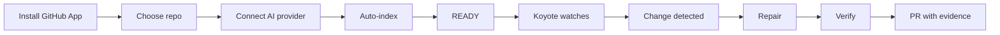
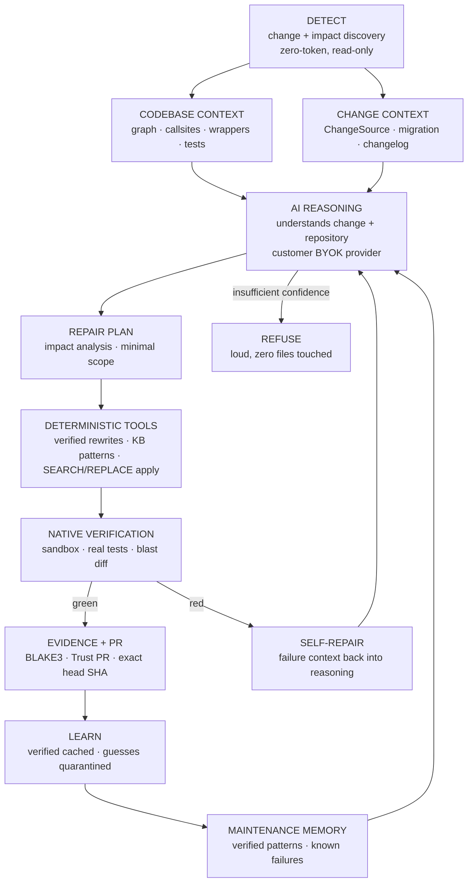

# Koyote System Map: Everything We Have

> One page that shows the whole machine. Code is the authority; this map tracks it.

## 1. User journey (what a stranger experiences)



## 2. Engine loop (what runs inside)



## 3. Module map (where it lives)

```mermaid
flowchart TD
    subgraph IN["Interfaces"]
        CLI["cli/main.py<br/>auth · doctor · index · check · fix · app · pr"]
        MCP["mcp_server.py<br/>audit · analyze · repair tools"]
        WH["github/webhook_server.py<br/>HMAC webhook daemon"]
    end
    subgraph CORE["Core engine"]
        CS["change_source.py<br/>ChangeSource · Detection"]
        DRIFT["drift.py<br/>detect_drift · detect_changes"]
        INTEL["intelligence.py<br/>KoyoteIntelligence · Decision"]
        REG["providers/registry.py<br/>8 providers · rewrite migrations"]
        AST["Rust ast · graph · autopatch<br/>callsites · aliases · rewrites"]
        PLAN["maintenance.py · pipeline.py<br/>run_maintenance_cycle · MaintenancePipeline"]
        AIplan["ai_planner.py<br/>SEARCH/REPLACE generation + retry"]
    end
    subgraph TRUST["Trust layer"]
        SB["sandbox + snapshot<br/>Landlock · Seatbelt · BLAKE3 rollback"]
        TR["test_runner.py<br/>real commands · real exits · no fake pass"]
        EV2["evidence · trust_pr<br/>hashes · receipts · badges"]
        KB["knowledge.py<br/>namespaced flywheel · failure quarantine"]
    end
    subgraph GH["GitHub surface"]
        BOT["pr_bot.py<br/>PR · @koyote comments · install handlers"]
        PROV["provisioning.py<br/>clone/pull cache · exact PR heads"]
        INST["installations.py<br/>PENDING→INDEXED→READY records"]
        WATCH["watch.py<br/>poll READY repos · fire on new drift"]
    end
    IN --> CORE --> TRUST --> GH
```



## 4. State on disk

```text
<repo>/.koyote/
  graph.json            dependency graph (Rust AST, zero-token)
  index_state.json      commit SHA + mtimes (incremental re-index)
  knowledge/            verified patterns (sdk/stripe/11.18.0__13.0.0.json…)
  history.json          auditable migration ledger
  snapshots/            pre-execution BLAKE3 rollback

~/.koyote/
  credentials.json            global BYOK (0600)
  installations/{id}.json     repos + READY states (0600)
  installations/{id}/{repo}   scoped BYOK credentials (0600)
  repos/{owner}__{repo}       managed git checkouts
```

## 5. Proof status

| Layer | Status | Pinned by |
|---|---|---|
| 529 Rust tests | green | `cargo test --all-targets` |
| 324 Python tests | green | `pytest tests/` |
| ruff + hygiene gate | clean | `scripts/run_all_tests.py` (step 0–1) |
| clippy | 0 warnings | `cargo clippy --all-targets` |
| Tier-1 controlled fixtures | done | trials/fixtures (stripe, openai, clerk, aws, sentry) |
| Tier-2 live demos | done | purpose-built demo repos |
| Tier-3 untouched upstream | 1 done (TalkGPT), quickstart attempted→rejected on RED rule | protocol enforced, not bent |
| Hosted daemon | code-ready (Dockerfile.app + DEPLOY.md), image unbuilt here | CI builds it |

## 6. Deliberately not built

MCP/GraphQL/protobuf connectors (types exist, resolve to quarantine) ·
multi-repo fan-out orchestrator · web dashboard beyond `doctor` ·
enterprise secret management beyond scoped 0600 files.
